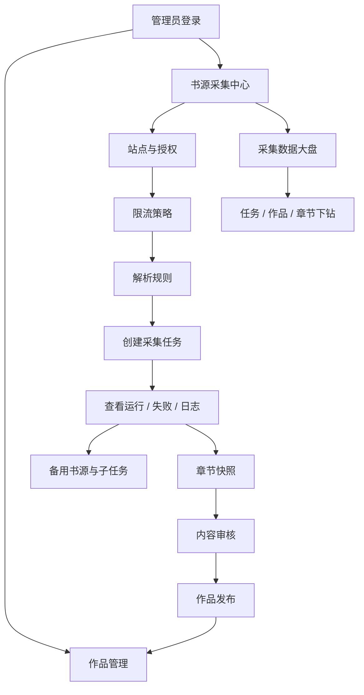

# 悦读 Reader PC 管理端

悦读 Reader PC 管理端是基于 Vue 3、TypeScript、Element Plus 和 Vite 的运营后台，配套悦读 Reader 后端使用。它负责作品运营、章节审核、作品发布、分类和榜单配置，以及书源采集中心的全生命周期管理。

项目底座参考开源 [RuoYi-Vue-Plus](https://gitee.com/dromara/RuoYi-Vue-Plus) 前端，沿用其布局、权限路由、请求封装、字典、分页、表格和系统管理能力，并在 `src/views/reader-admin` 下扩展阅读器管理页面。

## 技术栈

- Vue 3 + TypeScript
- Vite 8 + pnpm
- Element Plus + `@element-plus/icons-vue`
- Vue Router + Pinia
- ECharts：采集中心数据大盘和趋势图
- Oxfmt/Oxlint：格式与静态检查

## 功能范围

### 阅读内容运营

- **作品管理**：查看作品基本信息、作者、分类、连载状态、发布状态和横竖版封面。
- **作品详情**：查看章节列表、正文、封面候选、封面来源和采集关联信息。
- **作品分类**：维护全部实际作品分类，支持状态和排序管理。
- **榜单管理**：配置畅销榜、飙升榜、完结榜、新书榜及其他系统/手工榜单。
- **内容审核**：查看章节快照、正文差异和审核记录，通过后补偿入库并发布。
- **发布记录与反馈**：追踪发布动作、运营反馈和读者问题。

### 书源采集中心

采集中心按“站点 -> 策略 -> 规则 -> 任务 -> Worker -> 快照 -> 审核 -> 发布”组织页面，主要包含：

- 书源站点登记、授权说明、采集许可、黑名单和自动发现。
- 限流策略：并发、请求间隔、分钟请求上限、每日请求上限、超时、重试和熔断阈值。
- 解析规则：书籍列表、作品详情、章节目录和正文的声明式选择器。
- 采集任务：单本、全站、分类采集，书籍数量限制，章节范围和增量模式。
- 任务运行记录、失败分类、任务日志、任务书籍、章节快照和配置详情。
- 熔断重试、每日额度重试、批量启动/恢复/暂停/取消和备用书源续采。
- 采集数据大盘：任务、作品、章节、错误、日志和站点执行情况下钻。

## 页面与核心流程图



### 采集任务状态阅读方式

任务列表同时展示业务状态和执行状态。业务状态描述任务整体生命周期，执行状态描述 Worker 是否领取、是否实际采集、是否等待限流、是否等待每日额度或人工处理。失败分类会区分每日额度、401/403、5xx、超时、解析、质量、策略、SSRF 和分钟限流，避免把所有异常混成“采集中”。

批量操作使用表格多选；任务列表支持自动监控刷新，并按任务 ID 保留用户选择。批量操作完成后会清空选择，避免已操作任务在下一次监控刷新时被重新选中。

## 当前完成情况

- 已接入阅读器管理路由、作品管理、作品详情、内容审核、反馈、发布记录、作品分类和榜单管理。
- 已完成采集中心的站点、策略、规则、任务、自动发现、运行记录、错误、日志、快照和备用书源界面。
- 已支持主任务/子任务明细、每日额度和熔断重试、批量操作结果提示、配置详情和采集大盘下钻。
- 作品封面管理支持横版、竖版、背景样式、来源追踪和异步封面采集状态。
- 任务表格已处理自动刷新造成的多选丢失问题，任务 ID 作为稳定行键。

## 后续规划

- 为采集中心增加实时 SSE/WebSocket 运行流和异常告警。
- 为解析规则补充可视化选择器调试、样本回放和规则版本对比。
- 为大盘增加导出报表、按站点/作品/分类的长期趋势和成本统计。
- 补齐端到端浏览器测试，覆盖登录、批量任务操作、审核发布和任务下钻。
- 将 PC 管理端的操作权限与菜单初始化脚本建立自动校验，减少环境差异。

## 开发运行

```bash
pnpm install
pnpm dev
pnpm lint
pnpm build
```

默认访问地址由 `.env.development` 配置。生产部署前请使用环境变量注入 API 地址和加密配置，不要把真实密钥、日志和构建产物提交到仓库。
