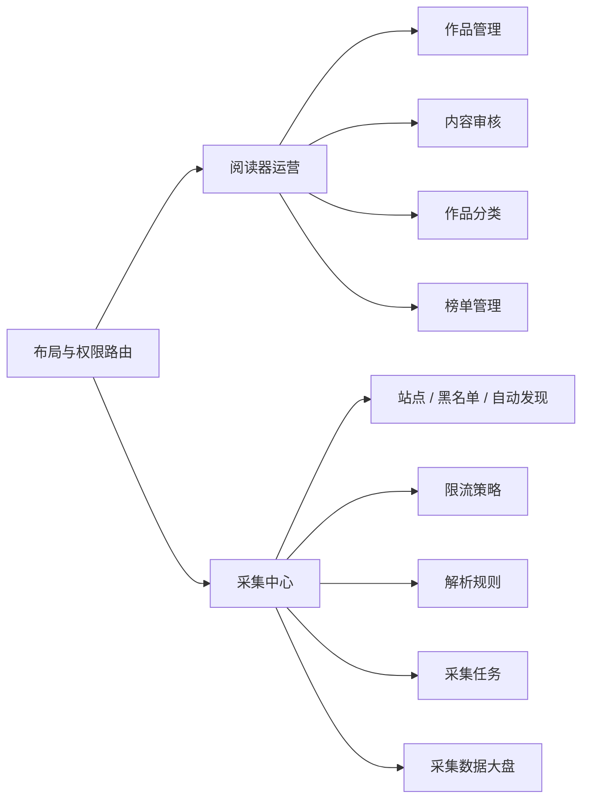
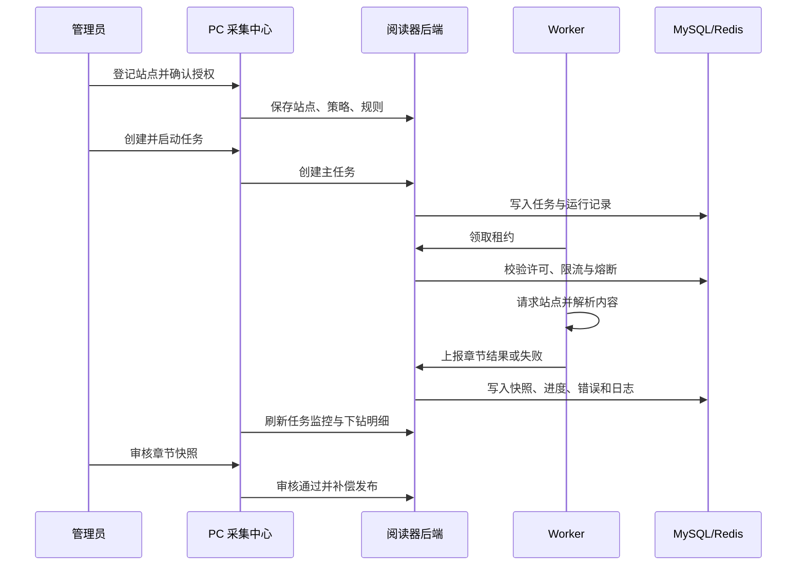

# PC 管理端页面架构与采集中心流程

## 页面分层

```mermaid
flowchart LR
    L[布局与权限路由] --> O[阅读器运营]
    L --> C[采集中心]
    O --> W[作品管理]
    O --> A[内容审核]
    O --> G[作品分类]
    O --> R[榜单管理]
    C --> S[站点 / 黑名单 / 自动发现]
    C --> P[限流策略]
    C --> Q[解析规则]
    C --> T[采集任务]
    C --> D[采集数据大盘]
```

## 采集中心交互时序

```mermaid
sequenceDiagram
    participant Admin as 管理员
    participant Page as PC 采集中心
    participant API as 阅读器后端
    participant Worker as Worker
    participant DB as MySQL/Redis
    Admin->>Page: 登记站点并确认授权
    Page->>API: 保存站点、策略、规则
    Admin->>Page: 创建并启动任务
    Page->>API: 创建主任务
    API->>DB: 写入任务与运行记录
    Worker->>API: 领取租约
    API->>DB: 校验许可、限流与熔断
    Worker->>Worker: 请求站点并解析内容
    Worker->>API: 上报章节结果或失败
    API->>DB: 写入快照、进度、错误和日志
    Page->>API: 刷新任务监控与下钻明细
    Admin->>Page: 审核章节快照
    Page->>API: 审核通过并补偿发布
```
